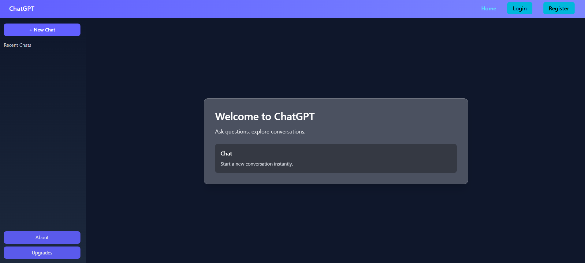
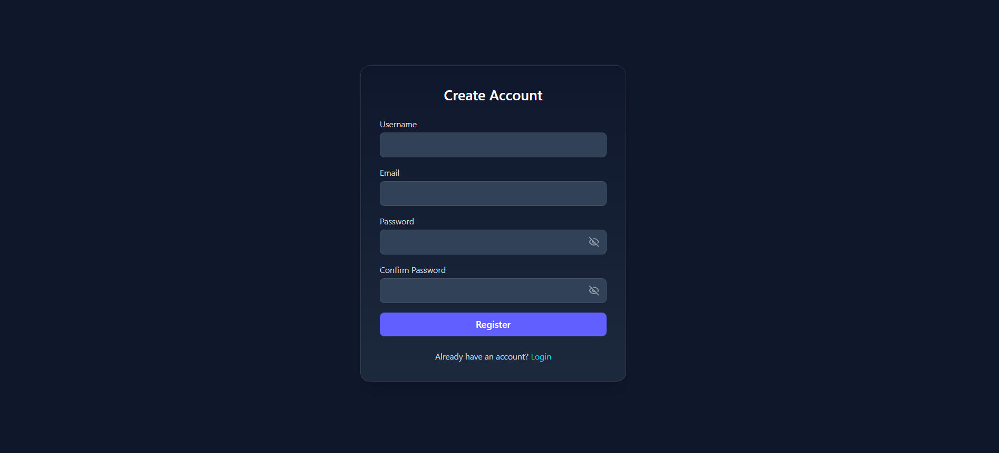
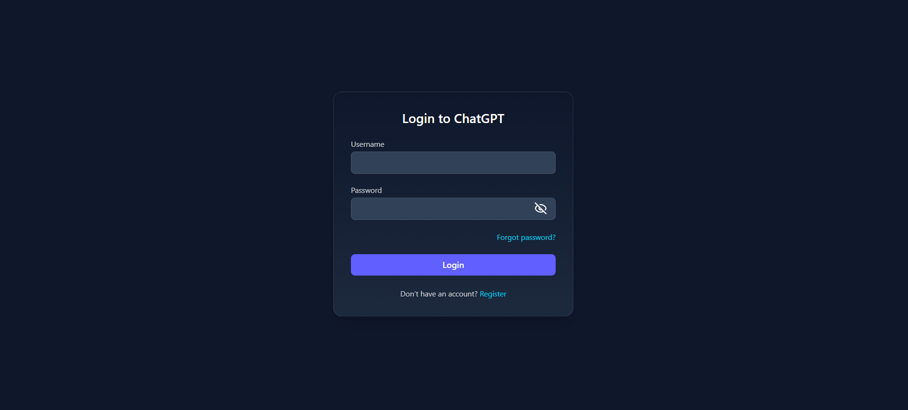
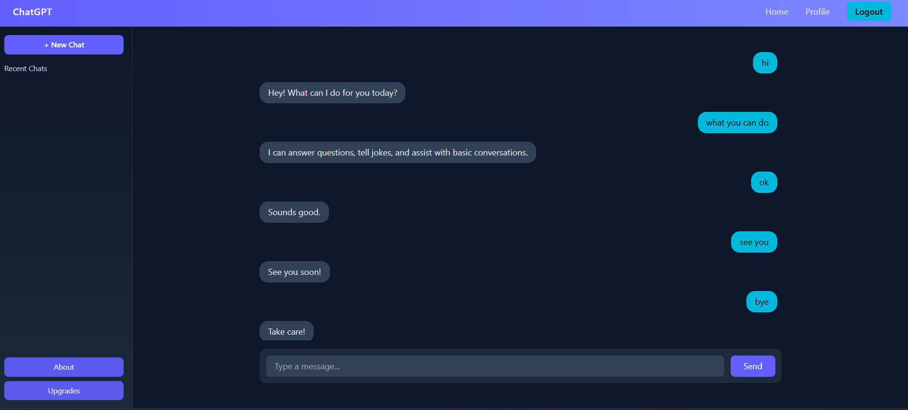
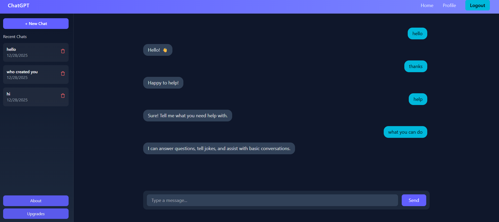
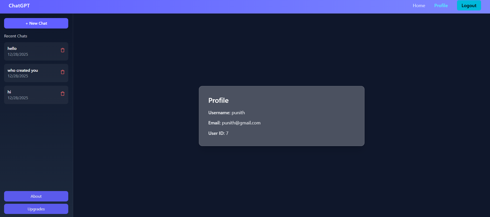

# Chat Application (React + Django REST Framework)

A full-stack chat application built using **React (Vite)** for the frontend and **Django REST Framework** for the backend.
The application supports authenticated users, persistent conversations, and a ChatGPT-like chat flow where a conversation is created only when the first message is sent.

---

## Overview (What Was Built)

This project is a ChatGPT-like chat application where users can register, log in, and interact with a chatbot.

Chats are organized into conversations, and chat history is preserved across sessions.

### Key Highlights

* Authenticated chat experience
* Conversation-based chat history
* Persistent storage of messages
* Clean and responsive UI

---

## Features

* User Authentication (JWT-based)
* Chat interface similar to ChatGPT
* Conversation-based chat history
* New conversation created only on first message
* Delete conversations
* Load previous messages
* Responsive UI using Tailwind CSS

---

## Tech Stack

### Frontend

* React (Vite)
* React Router
* Context API
* Tailwind CSS

### Backend

* Django
* Django REST Framework (DRF)
* JWT Authentication (SimpleJWT)
* SQLite

---

## Architecture

The application follows a **client–server architecture**.

```
Frontend (React)
        ↓
REST API (HTTP / JSON)
        ↓
Django REST Backend
        ↓
Database (Conversations & Messages)
```

* The frontend handles UI rendering and user interactions.
* The backend exposes REST APIs for authentication, conversations, and messages.
* JWT tokens are used for secure authentication.
* Chat data is persisted in the database.

---

## Design Decisions

* **React + Vite** for fast development and optimized builds.
* **Django REST Framework** for clean and scalable API design.
* **JWT authentication** for stateless and secure sessions.
* Conversations are created **only when the first message is sent**, avoiding empty records.
* A **rule-based chatbot logic** is used instead of external AI APIs, as per assignment constraints.

---

## Chat Logic Explanation (No External AI APIs)

This chatbot does **not** use OpenAI or any external AI services.

* Messages are processed using a **rule-based / intent-based logic**.
* Keywords in user input are matched against predefined intents.
* A predefined response is returned for each matched intent.
* Logic is implemented in `core/logic.py`.

---

## Persistence Strategy

* Conversations and messages are stored in the database.
* Each message is linked to a user and a conversation.
* On page refresh or re-login:

  * Conversations are fetched
  * Messages are loaded from the database
* Chat history persists across sessions and server restarts.

---

## Project Structure (Simplified)

```
CHATGPTBOT/
├── backend/
│   └── chatbot/
│       ├── chatbot/
│       ├── accounts/
│       ├── core/
│       ├── db.sqlite3
│       └── manage.py
│
├── frontend/
│   └── chatbot/
│       ├── src/
│       ├── package.json
│       └── vite.config.js
│
├── screenshots/
├── USAGE.md
└── README.md
```

---

## Screenshots








---

## Documentation

* 📄 [Project overview and features](README.md)
* 📄 [Setup, flow, APIs, and authentication](USAGE.md)
* 📄 [System architecture and design](ARCHITECTURE.md)

---

## Author

**Punith J**
📧 [punithrajkumar3504@gmail.com](mailto:punithrajkumar3504@gmail.com)
🎓 BCA Student
💻 Full-Stack Developer (React + Django)
